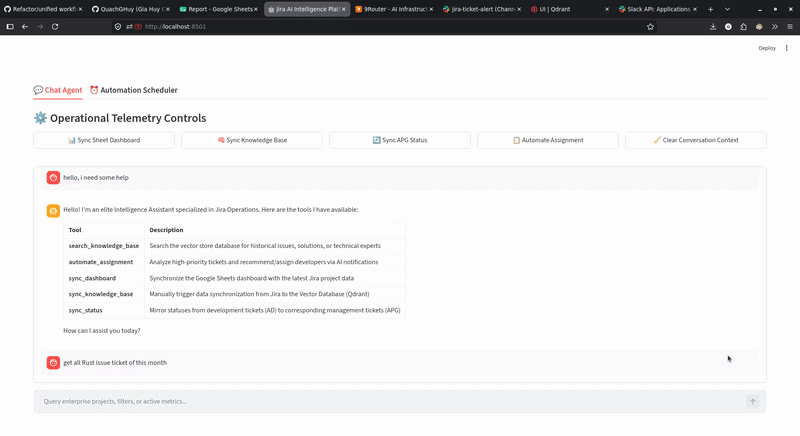
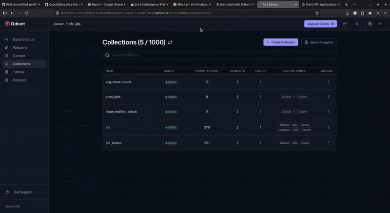
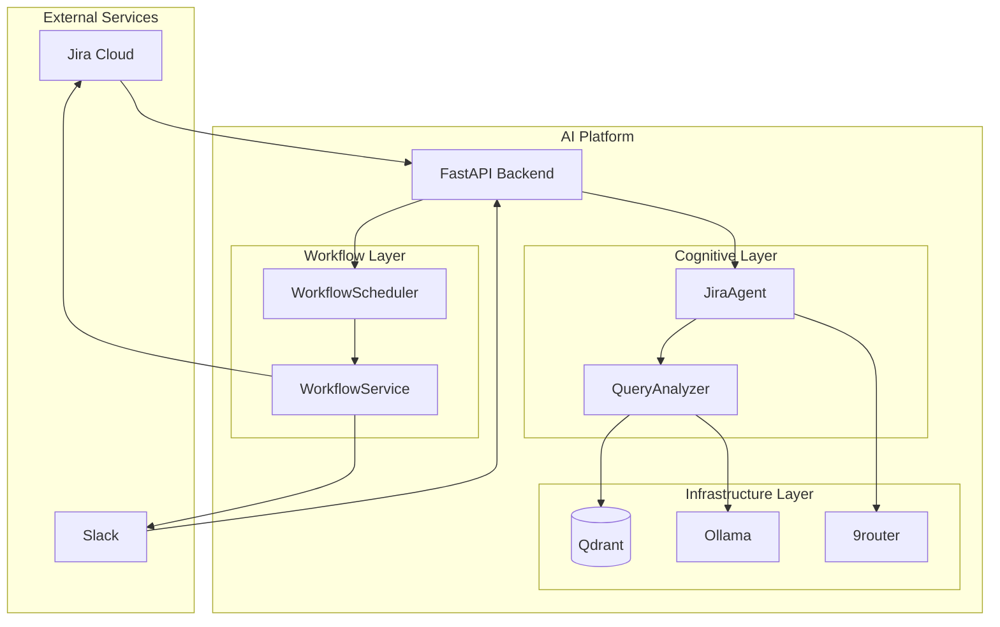
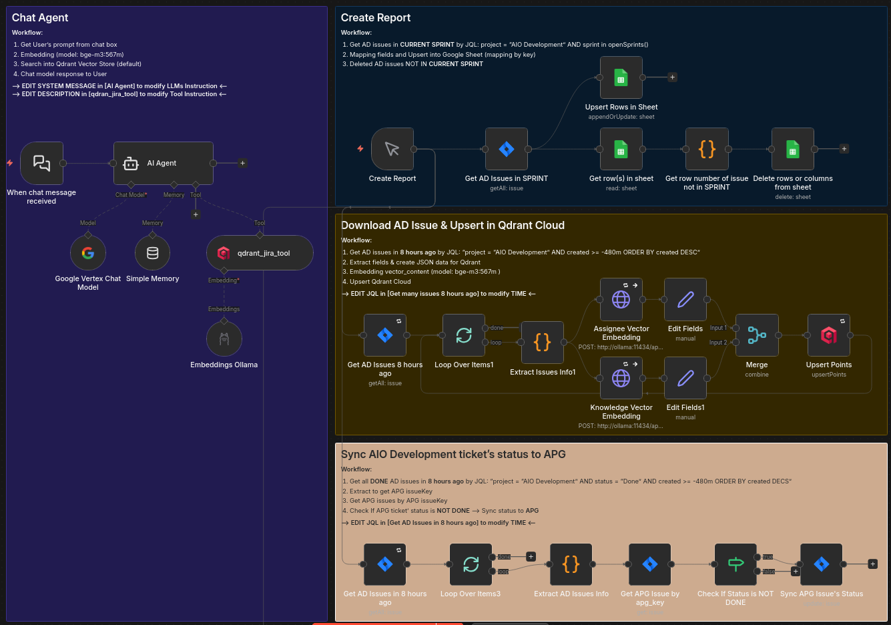
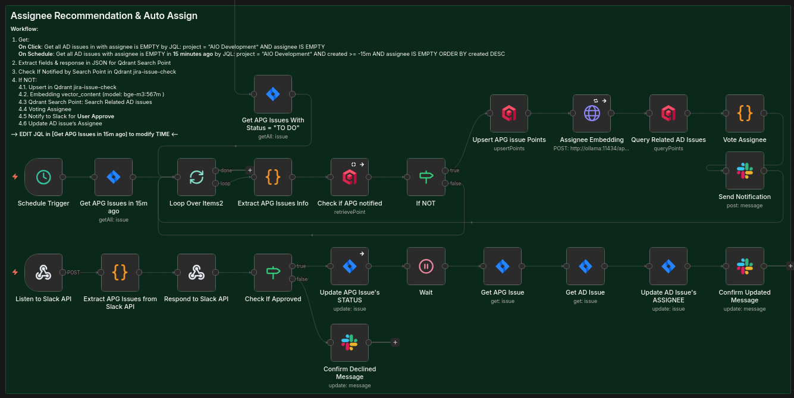

# 🤖 Zero-Cost AI Jira Operations Platform

> AI-powered Jira workflow automation platform with semantic search, async scheduling, structured retrieval, and zero-cost local AI infrastructure.

<div align="center">


</div>

---

# 💡 Why This Project Exists

This project started from a real operational problem.
A close friend of mine was working two jobs at the same time and needed a way to reduce repetitive Jira management tasks from the second job without increasing operational costs.
Most of the daily workload was not highly technical work — it was repetitive coordination work around Jira:

* assigning simple tickets to the right developer
* generating Google Sheets reports
* syncing statuses between projects
* monitoring updates through Slack
* understanding product context, ongoing team activities, and issue discussions through AI-assisted Jira search

My friend was working as a Product Owner, so understanding what different teams were building, what blockers they were facing, and how tickets were progressing across projects was extremely important.
Instead of manually reading through large amounts of Jira tickets and comments, LLM-powered search and summarization could provide faster explanations and operational insights.
The situation became more difficult because access permissions on Jira were limited, making cross-board coordination slow and repetitive.
The goal of this project was to automate as much of that operational workload as possible using mostly free infrastructure and local AI services.
The platform eventually evolved into an AI-powered operations system capable of:

* semantic Jira issue search
* AI-based assignee recommendations
* automated workflow scheduling
* cross-board status synchronization
* AI-generated Slack reports
* Google Sheets reporting automation
* mobile-friendly Slack interactions for quick ticket actions

For example, simple tickets can now be reviewed and assigned directly from Slack on a phone without opening Jira manually.
Complex tickets and high-level decision making still require manual engineering work, but the system already removes a large portion of repetitive operational tasks.
In practice, the platform is able to reduce roughly 50% of the daily coordination workload.


---

# 📖 Overview

This project is an AI-driven engineering operations platform designed to automate Jira workflows using semantic search, structured AI reasoning, and async background scheduling.

The platform can:

* search Jira issues using semantic vector retrieval
* generate structured metadata filters automatically
* run scheduled Jira workflows asynchronously
* sync Jira data into vector databases
* generate AI-powered Slack reports
* operate using almost zero AI token cost

The system combines:

* FastAPI async backend services
* LangChain agent runtime
* APScheduler workflow automation
* Qdrant vector search
* Ollama local embeddings
* Slack integrations
* Docker multi-container deployment
* Cloudflare secure tunnels

---

# 🎥 Demo

<table width="100%">
  <tr>
    <td align="center" width="50%">
      <p align="center"><b>📊 Google Sheets Dashboard Sync</b></p>
      
    </td>
    <td align="center" width="50%">
      <p align="center"><b>🧠 Qdrant Knowledge Base Sync</b></p>
      
    </td>
  </tr>
  <tr>
    <td align="center" width="50%">
      <p align="center"><b>🔄 APG Cross-Project Status Sync</b></p>
      
    </td>
    <td align="center" width="50%">
      <p align="center"><b>🤖 AI Agent & Automation Jobs Management</b></p>
      
    </td>
  </tr>
</table>

---

# 🧬 Project Evolution

This project originally started as an n8n prototype for rapid workflow experimentation.

As the system became more complex, the architecture was migrated into a custom Python + FastAPI platform to support:

* async workflow execution
* dynamic scheduling
* semantic vector retrieval
* AI orchestration
* modular services
* better scalability

---

# 🏗️ Architecture

## High-Level System Design



---

# 🧠 AI Architecture

## Supervisor-Style AI Design

The platform uses a supervisor-style AI architecture.

### JiraAgent

The main AI agent is responsible for:

* conversation handling
* tool selection
* workflow orchestration
* AI reasoning
* memory management

### QueryAnalyzer

The QueryAnalyzer is a specialized semantic retrieval component.

It converts raw user input into structured search contracts for Qdrant vector search.

Example responsibilities:

* entity extraction
* metadata filtering
* date parsing
* semantic query planning
* structured JSON generation

---

# 🔍 Semantic Search Pipeline

Instead of sending raw prompts directly into the vector database, the platform first generates structured search instructions.

## Query Flow

```text
User Prompt
    ↓
JiraAgent
    ↓
QueryAnalyzer
    ↓
Structured Search Query
    ↓
Qdrant Hybrid Search
    ↓
Retrieved Context
    ↓
Final AI Response
```

---

# ⚡ Workflow Automation Engine

## Dynamic Async Scheduler

The platform includes a fully asynchronous workflow scheduler powered by APScheduler.

Schedules are dynamically loaded from storage and rebuilt at runtime.

### Features

| Feature             | Description                |
| ------------------- | -------------------------- |
| Async workflows     | Native coroutine execution |
| Dynamic schedules   | Hot-reload cron jobs       |
| Reflection dispatch | Runtime workflow loading   |
| AI reporting        | Automatic Slack summaries  |
| Parallel execution  | Multiple concurrent jobs   |
| Failure isolation   | Independent task execution |

---

## Workflow Execution Flow


---

# 🤖 AI-Generated Operational Reports

After each scheduled workflow execution, the platform automatically:

1. collects execution telemetry
2. summarizes results using AI
3. formats Slack-ready updates
4. sends notifications to engineering channels

Example output:

```text
✅ **Auto-Assignment Complete** — Automated ticket assignment executed successfully
🔧 Filter: project = 'APG' AND status = 'To Do'
📊 Developers notified: **1**, Tickets skipped: **4**
🚀 Team, your assigned tickets are ready for action — let's ship it!
```

---

# 🔎 Hybrid Retrieval Strategy

The retrieval system separates:

| Layer            | Purpose                        |
| ---------------- | ------------------------------ |
| Semantic Search  | Understand meaning and context |
| Metadata Filters | Apply exact constraints        |

This design improves retrieval accuracy and reduces semantic ambiguity.

---

# 🧠 Semantic Similarity

Semantic search is used to understand contextual relationships between Jira issues.

The retrieval engine evaluates vector similarity using cosine similarity:

$$
\text{Similarity}(q, d) =
\frac{q \cdot d}{|q| |d|}
$$

---

# 🌐 Zero-Cost AI Infrastructure

## Ollama Local Embeddings

The platform uses Ollama for local embedding generation.

Current embedding model:

```text
bge-m3:567m
```

Benefits:

* local inference
* multilingual embeddings
* zero token cost
* GPU acceleration
* support for long-context embeddings

---

## 9router Inference Routing

Inference requests are balanced across free providers using 9router.

### Features

* round-robin routing
* automatic failover
* free-tier optimization
* retry handling

---

## Cloudflare Tunnel

The platform uses Cloudflare Tunnel to securely expose the local backend without:

* public IP setup
* router configuration
* manual port forwarding

---

# 📂 Project Structure

```text
.
├── .secrets/
│   └── service_account.json
├── backend/
│   ├── app/
│   │   ├── ai_engine/
│   │   ├── api/
│   │   ├── core/
│   │   ├── schemas/
│   │   └── services/
│   ├── Dockerfile
│   └── main.py
├── frontend/
│   ├── Dockerfile
│   └── streamlit_app.py
├── assets/
├── .dockerignore
├── .env.example
├── .gitignore
├── docker-compose.yml
└── README.md
```

---

# 🚀 Deployment

## 1. Configure Environment Variables

Copy the environment template:

```bash
cp .env.example .env
```

Then configure your credentials inside `.env`.

Example:

```env
JIRA_DOMAIN_URL=
JIRA_API_TOKEN=

SLACK_BOT_TOKEN=

QDRANT_URL=
QDRANT_API_KEY=

LLM_BASE_URL=
LLM_API_KEY=
```

---

## 2. Start Infrastructure Containers

Boot all services:

```bash
docker compose up -d
```

This will start:

* FastAPI backend
* Streamlit frontend
* Ollama
* Qdrant integrations
* Cloudflare tunnel
* 9router

---

## 3. Download the Ollama Embedding Model

Initialize the embedding model inside the Ollama container:

```bash
docker exec -it ollama ollama run bge-m3:567m
```

This model is used for:

* semantic embeddings
* Qdrant retrieval

---

## 4. Get the Public Cloudflare Tunnel URL

Check the Cloudflare tunnel logs:

```bash
docker logs -f tunnel
```

Look for a generated public URL similar to:

```text
https://example-name.trycloudflare.com
```

Use this URL for:

* Slack Interactive Events
* Jira Webhooks

---

## 5. Configure 9router

9router runs locally on:

```text
http://localhost:20128
```

Configure your `.env`:

```env
LLM_BASE_URL=http://9router:20128/v1
LLM_CHAT_MODEL=<your-router-model-name>
LLM_API_KEY=<your-router-key>
```

---

## 6. Restart Backend After Infrastructure Setup

Once Ollama and 9router are fully initialized, restart the backend container:

```bash
docker compose up -d backend
```

This ensures:

* model connections are ready
* routing endpoints are available
* embedding services are reachable

---

# ✅ Platform Ready

The platform should now be available:

| Service            | URL                          |
| ------------------ | ---------------------------- |
| FastAPI Backend    | `http://localhost:8000/docs` |
| Streamlit Frontend | `http://localhost:8501`      |
| 9router            | `http://localhost:20128`     |

---

# 🛠️ Technology Stack

| Category        | Technologies         |
| --------------- | -------------------- |
| Backend         | FastAPI, Python 3.12 |
| AI Runtime      | LangChain            |
| Scheduler       | APScheduler          |
| Vector Database | Qdrant               |
| Embeddings      | Ollama               |
| Frontend        | Streamlit            |
| Infrastructure  | Docker Compose       |
| Networking      | Cloudflare Tunnel    |
| AI Routing      | 9router              |

---

# 🎯 Key Features

* AI-powered Jira workflows
* semantic issue search
* structured query planning
* async workflow automation
* dynamic cron scheduling
* AI-generated Slack reports
* local embedding generation
* zero-cost inference routing
* hybrid vector retrieval
* Dockerized infrastructure

---

# 🔮 Future Improvements

Planned upgrades:

* explicit LangGraph workflows
* distributed task queues
* structured logging
* tracing & observability
* workflow telemetry
* retry policies
* persistent memory storage
* advanced routing policies
* multi-agent coordination

---

# 🧬 Original n8n Prototype

The first version of this platform was built using n8n for rapid workflow prototyping.

As workflow complexity and AI orchestration requirements increased, the project evolved into a custom FastAPI-based architecture.

n8n workflow JSON files and screenshots are available in:

```text
/assets/n8n_workflow
```





---

# 👤 Author

## Huy Quach

* **GitHub**: [@QuachGHuy](https://github.com/QuachGHuy)
* **LinkedIn**: [Gia Huy Quach](https://www.linkedin.com/in/gia-huy-quach/)

---
